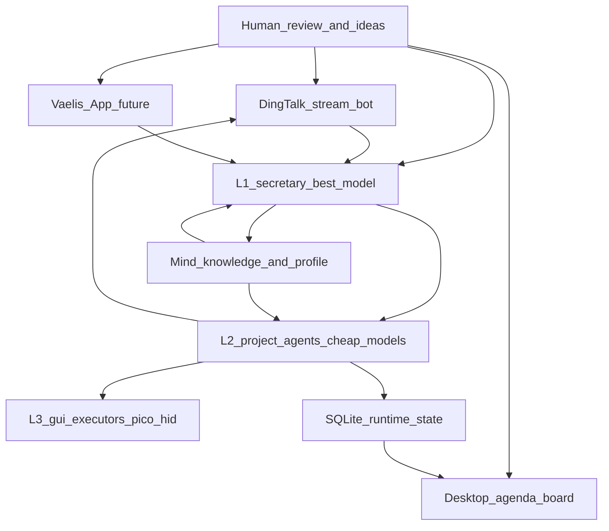

# North Star 架构（最终形态）

真源决策见 [GRILL_FREEZE.md](./GRILL_FREEZE.md)。短期 MVP 目标见 `docs/specs/MVP-AI-Secretary-Requirements.md`。

## 角色

| 层 | 职责 | 算力 |
|---|---|---|
| **L1** | 统筹、决策、派工、与你对话；只收摘要 | 市面最好（当前 Kimi K3） |
| **L2** | 每项目/专职任务一个，领域闭环，有记忆 | 便宜模型或 aigw 聚合 |
| **L3** | 专能子 Agent + GUI 闭源软件执行体 | 尽量零 token（Pico HID） |

| 存储 | 用途 |
|---|---|
| **Mind** | 知识与画像真源；`MIND_ROOT` + 单 git remote |
| **SQLite** | 运行时状态（日程 / DDL / 任务），ADR-0007 |

## 原则

1. **品牌独立**：Vaelis 产品契约不变；底座可替换。  
2. **先复用再自建**：全 GitHub + [OSS_REUSE.md](./OSS_REUSE.md)（O3）。  
3. **深模块 W1**：胖在 L2 领域包与 Mind；L1 不吞脏上下文。  
4. **FE/BE 分离**：UI 只走 HTTP；桌面端统一经 `apps/desktop/src/hermes.ts` 的 `window.hermesDesktop.api({ path })`，页面内禁裸 `fetch`。  
5. **设计一致**：桌面新界面遵守 `apps/desktop/DESIGN.md`（复用 primitive、只用 token、四语言同步）。

## 成本纪律

L1 用旗舰模型（K3 输出 ¥100/M 且始终思考，推理计入输出），因此：

- L1 **不进**工具循环、不做逐条分类抽取，只接摘要与决策请求。
- L1 与 L2 **独立会话**，不在同一条消息历史中切换模型。
- 分类 / 抽取 / 执行下放 L2；能用 GUI 免费额度的下放 L3。

## 人机面演进

1. **现在**：Electron 内置日程看板（ADR-0008）+ 钉钉 Stream 双向机器人（推送 + 文本确认）。  
2. **以后**：独立 Vaelis App 承接手机指挥面；钉钉降级为通知通道。

## Mind 接线

- 适配：`plugins/memory/mind/`（当前为空壳，按切片做实；合规见 `docs/specs/MIND_ADAPTER_PLAN.md`）。  
- **读**：L2 直读自己项目子树；L1 读画像。  
- **写**：统一经不带 LLM 的串行写入服务（安全前缀 + 批量提交 + verifier 预检）。  
- **边界**：Mind 存知识与画像，不存高频运行时状态。

## GUI 执行体与设备

- Marvis 等闭源 GUI 走 L3；协议可用的表面走 aigw。  
- Pico 仅一只 → **优先级队列**（前台交互 > 时效任务 > 夜间批量），带时间片与抢占（ADR-0011）。  
- 夜窗可配置；供电 K3 降级策略见 [RISK_AND_GATES.md](./RISK_AND_GATES.md)。
